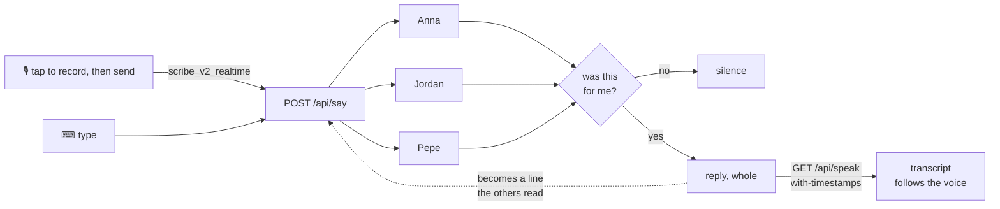

# Teaching agents to shut up

<p align="center">
  
</p>

**The room**, live: [voice-group-chat.up.railway.app](https://voice-group-chat.up.railway.app).

Three agents in a browser. They read the same transcript, each
decides for itself whether a line was meant for it, and the one that answers
answers out loud. Type into it, or tap the microphone to record, then tap Send.

A recording ends three ways: **✕** throws it away, **■** stops it and drops the
transcript into the field to read, edit or abandon, and **↑** sends it as it
stands. Only the last one spends a turn.

The transcript is the context — every agent reads the whole thing before deciding
whether the last line was for it — so the eraser in the header is how a room
starts over: it asks once, then deletes the conversation from all three agents
and from every screen that has the room open. Names, drafts and the board stay.

For the frontend code walkthrough, credential-free tests and observability
workflow, see the [developer guide](web/docs/developer-guide.md).

**Conversation challenge:** the room asks your name once, on arrival — it is what
the agents call you, and what a score is published under. Tap the trophy for the
rules, then Play: the microphone opens and the counter starts running beside the
trophy. The room stays the same; each new agent reply adds a point. There is no
target and nothing to win: the round runs for as long as the agents keep
answering each other, and the score is how far it got before the room went quiet,
you stopped it, or the four-minute deadline arrived. When the round ends the score
publishes itself under that name and the modal answers with the place it took —
**#4 of 61** — with **Play again** under it. The
leaderboard is optional: `/challenge` and the header button show the global
ranking, which contains only names and scores; conversation content remains in
the shared room. See the [rules, storage and security
boundary](web/docs/challenge.md) before opening it to untrusted traffic.

Built as customer zero. Every number below came off this project's own
free-plan key.

```
> hey everyone, how's it going?
  Anna stayed quiet
  Jordan stayed quiet
  Pepe stayed quiet

> hey ana ask pepe what time it is
  Anna: Pepe, what time is it?
  Jordan stayed quiet
  Pepe stayed quiet
  Pepe: It's 3:47pm.
```

## The shape



The dotted edge is the part that makes it a room: an agent's reply re-enters as
a line attributed by name, exactly like a person's, and the round ends when
nobody thought the last thing said was for them.

## Stack

| | |
|---|---|
| Chat | `openai/gpt-5.6-sol` via OpenRouter |
| TTS | `eleven_flash_v2_5`, `/with-timestamps` |
| STT | `scribe_v2_realtime`, realtime WebSocket |
| UI | ElevenLabs UI on shadcn, Next.js 16, React 19 |
| Agents | [Hermes](https://github.com/NousResearch/hermes-agent), one process each |

What the room sounds like — the TTS model, the ten voices, the language and how
loud somebody has to be before it listens — is `speech.json` at the root, read by
the Python and by the browser. It used to be a copy in each language with a test
that parsed one of them from the other; agreement is not a thing to test for when
both can read the same file. The chat model is `DEFAULT_MODEL` in
`src/defaults.py`.

---

## A bug in the UI registry: [elevenlabs/ui#82](https://github.com/elevenlabs/ui/issues/82)

```ts
// blocks/realtime-transcriber-01/page.tsx:334
modelId: "scribe_realtime_v2" as const   // the API wants scribe_v2_realtime
```

The socket **opens**, then the server closes it. So it reads as a broken
microphone, not a bad parameter:

```
{"message_type":"invalid_request",
 "error":"The model_id 'scribe_realtime_v2' is invalid. Supported models:
          'scribe_v2_realtime', 'scribe_v2_realtime_turbo', 'scribe_v2_realtime_lite'."}
closed 1008 invalid_request
```

Same value in `public/r/realtime-transcriber-01.json`, so `shadcn add` ships it
broken. `elevenlabs/examples` already has it right. Filed with a standalone
repro, 2026-08-29, and fixed in
[elevenlabs/ui#83](https://github.com/elevenlabs/ui/pull/83).

## A gap in the realtime SDK: knowing the microphone is live

`session_started` says the server accepted the session. It does not say the
browser is sending anything — permission, the `AudioContext` and the worklet all
resolve separately, and a session can be open while nothing is being captured.
Telling somebody "listening" at that point is a promise the page cannot keep.

`@elevenlabs/client` defines 23 realtime events, in 1.23.0 and still in 1.25.0.
Every one is about the session, a transcript, or an error; none of them fires
when audio starts flowing. So this room wraps the connection's own `send` to notice the first
chunk, and only then calls itself listening:

```ts
const send = connection.send.bind(connection)
connection.send = (data) => { send(data); if (!audioStarted) { audioStarted = true; activate() } }
```

Patching a method the SDK owns is the wrong shape for a supported integration,
and it breaks silently whenever the internals move.

There is a public extension point, `setScribeMicrophoneSetup`, paired with
`getScribeMicrophoneSetup` so the web implementation can be wrapped rather than
replaced. It is documented for supplying a microphone on a non-web platform,
and it is a process-wide singleton: one setup for every connection in the tab,
installed once, with no connection to attribute a chunk to.

What would remove the patch is either a `RealtimeEvents` member for the first
audio frame, or an `onAudioData` callback on `Scribe.connect` alongside the
existing `microphone` options — per connection, where the consumer already is.
The commit flow needs the same signal for a second reason: with
`CommitStrategy.MANUAL`, committing has to wait for the capture buffer to drain
past `mute()`, and counting chunks is the only way to know it has.

## Text to speech

Same voice, same sentence:

| | |
|---|---|
| `eleven_flash_v2_5` | **0.7s** |
| `eleven_multilingual_v2` | 1.2s |
| `eleven_v3` | 2.7s |

Two decisions worth more than the model choice.

**Synthesis left the turn.** It used to run inside the agent, so the reply did
not leave until the MP3 existed: `1.96s of a 4.14s turn`, spent on an empty
room. The browser asks for audio now, and the text lands two seconds sooner.

**The route answers JSON, not audio**, because it asks for the timings:

```ts
POST /v1/text-to-speech/${voice}/with-timestamps
→ { audio_base64, alignment: { characters, character_start_times_seconds } }
```

That is what lets the transcript follow the voice through the line instead of
sitting there finished while somebody is still saying it. Held whole, not
streamed: there is no streaming variant of the timings, and on a 211-character
reply the full clip took 2.3s against 1.9s to first byte.

Emoji come off on the way to the synthesiser only. A voice reads them as their
names, "Hey Fabri waving hand", which is tone being pronounced instead of felt.

Three smaller decisions in the same request. `mp3_44100_64` halves the default
bitrate at the same sample rate, because this is base64 inside JSON on its way
down a phone network. `previousText` carries the line being answered, so a reply
lands on the intonation of an answer instead of starting the room again from
silence — it travels with the grant the room issued for THAT line, because "only
what this room said" does not get to lapse for the sentence beside the one being
spoken. And the clip is kept, keyed by the hash of everything that decides it, so
a transcript people scroll back through replays for free.

**Voices** are picked on `high_quality_base_model_ids`, how many current model
families actually render them. Most premade voices sit at 7 or 8. Adam, who led
the account list for months, sits at **0**: a 2023 voice carried for
compatibility, which is exactly why he sounded flat. Nothing under 7 is in the
list. The shared library needs Creator tier and fails quietly on free
(`paid_plan_required`, `free_users_not_allowed`), so ten premade voices is what
a free key can demo.

## Speech to text

The key never reaches the browser:

```ts
POST /v1/single-use-token/realtime_scribe   →  one session, nothing else
```

**A gate before the socket.** The agents answer out loud, so on a phone the
microphone hears them through the speaker, and a transcriber has no opinion about
which voice in the room it was meant to write down. Under `gate` in `speech.json`
the audio is measured for the meter and then dropped: a chunk that never leaves
the browser cannot be transcribed, charged for, or mistaken for a word. It opens
on the level and closes at half of it a moment later, and the chunks from just
before it opened go with it, so a sentence keeps the start of its first word.
`filterBackgroundAudio` asks ElevenLabs for the same idea at the other end.

**Press to speak, not open mic.** An open microphone was built first and cut: in
a room where three agents talk out loud, no VAD threshold separates a person
from a speaker reliably enough to send what it heard to three agents unasked.
What survived is one testable function, `lib/listening.ts`, deciding whether
anything was said between the two presses. Fillers and `[BLANK_AUDIO]` come off;
one real word still counts, because "sí" and "stop" are whole turns.

**The transcriber renamed an agent.** She was Ana. "Ana" and "Anna" are one
sound in two languages and a transcriber listening in English writes the English
one, so she sat silent while being called by name, out loud, twice. Fixed both
ways: the addressing check collapses held letters, and she is spelled Anna now.
Invisible in any text-only test.

Measured 2026-08-29: first partial in 3-4s, full sentence recovered, on
Rioplatense Spanish. These are historical live measurements, not a promise for
the current UI or another device. The current recording path exposes setup,
first-text, render and finalization timings in `/?perf=1`, and waits for final
text before dispatching. See the [metric definitions](web/docs/developer-guide.md#diagnosing-transcription).

## ElevenLabs UI

`Orb`, `LiveWaveform`, `Conversation`, `Message`, `Response` and the Scribe hook
came from the registry. The original integration needed three changes:
correct in a demo, load-bearing here.

| | |
|---|---|
| `useTexture` suspends on a CDN fetch | Three empty holes where the agents go, for as long as `storage.googleapis.com` takes. 45KB, served from `/public` now. |
| `THREE.WebGLRenderer: Context Lost.` ×3 | A capped resource the browser reclaims when it likes. An SVG orb sits underneath, paints on frame one, cannot be lost. |
| Two scroll springs, one element | `use-stick-to-bottom` and the room both eased toward `scrollHeight`, a target that moves mid-flight. Both instant now, so they cannot disagree. |

The current stage uses CSS gradients instead of WebGL, and the composer owns
its recording lifecycle directly through the SDK. The old waveform opened a
second microphone stream; the recording indicator now shares no capture work.
The table above records the original findings, not the current render path.

## Evaluated, not taken

| | |
|---|---|
| `text-to-dialogue` | Works on free (113,728 bytes, 7.0s, two voices). Lost on latency: first sound **+0.0s → ~+15.2s**, because a dialogue needs every reply before it can start. |
| TTS `/stream` | Verified 200. Superseded by `with-timestamps`, same two seconds plus the timings. |
| streaming the model | **469 turns ended in a suppress token.** Streaming means showing text from an agent that then says nothing. |
| `elevenlabs/examples` | A pass over all of it, with what this room would have to become for each to fit. |
| the Agents platform | The obvious question, and the answer is what this project is about. An agent there is one agent: one voice, one memory, one turn-taking policy, and a person talking to it. The subject here is what happens with THREE, each its own process with its own memory and persona, none of them told whose turn it is — the turn-taking is the experiment, not the plumbing under it. Voice, transcription and timings come from ElevenLabs; whose line it is does not. |

## The agents

Upstream Hermes through its public plugin interfaces. No fork: three hooks and
one middleware. Each agent is its own process with its own memory and its own
persona, every line reaches everyone, and nobody is told whose turn it is.

The turn-taking policy came over from a text product I had already run in
production, so porting it was mostly deleting the transport. Two rules carry it:
a turn that ends in nothing counts as success, and addressing is a function
rather than a prompt. `SETUP.md` has the long version.

```
20:07:13 [llm]     round=1 gpt-5.6-sol in=310 (cache_r=26,112 hit=99%) out=81 stop 3.2s
20:07:16 [policy]  quiet   reason='suppress token' raw=8 → 0
```

## Games to paste in

The turn-taking policy is the interesting thing to break, and a word game breaks
it hardest: three agents who only speak when addressed, and a round that has to
survive twenty handoffs with nobody conducting it. Two rules decide whether it
lives. Every line has to end on a name, because a line that names nobody is a
line nobody picks up and the round dies on its first step. And no line may
address whoever is holding the microphone, because the moment one of them turns
to ask me something, all three wait for a human who was only watching.

So each prompt below says who goes next, forbids talking to me, and asks for one
clause of colour per turn. That last part is what makes them worth watching: an
agent handed "give one animal" answers `Mongoose.` and the round reads like a
spreadsheet, while the same agent asked for a reason answers in the voice it was
dealt. Paste one in and say nothing else.

**Tutti Frutti**

```
Play Tutti Frutti, just the three of you. The letter is M. The categories run in
this fixed order: name, country, food, animal, colour, object. On your turn give
one item for the category you were handed, then hand the next category to
whichever of the other two has not gone yet, by name. Add one short clause of
colour to your item in your own voice: where you met it, why it came to mind,
what it costs, what breaks about it. One sentence for the whole turn. No repeats,
and if an item was already said answer "repeated" and give another. When the six
categories are done, whoever answered last starts a new round on the next letter
and hands off again. Never ask me anything and never say my name; the game is
between the three of you and it runs until I stop it.
```

**Word chain**

```
Word chain, three players, nobody else. Each turn is one word starting with the
last letter of the word before it, then a short clause saying why that word and
not another (an image, a memory, a complaint, something in character), then the
name of whichever of the other two did not just speak. One line: one word, one
reason, one name. No repeats and no proper nouns. If you are handed a word ending
in an awkward letter, say so in the same breath and solve it anyway. Do not
address me at all; I am only watching.
```

**Countdown with traps**

```
Count down from 100 between the three of you. On your turn say the next number,
but if it is divisible by 3 say a fruit instead, if it is divisible by 5 say a
city instead, and if it is divisible by both say the fruit and the city. After
the number or the substitute add one short clause about it in character: what
that number reminds you of, why that city, what that fruit costs this week. Then
name whichever of the other two spoke least recently, so nobody goes twice in a
row. One line each. Never break the count to talk to me.
```

**One sentence at a time**

```
Tell one story between the three of you, one sentence per turn. Every sentence
must begin with the last word of the sentence before it, not counting the name at
the end, and must finish by naming who tells the next one. Each sentence has to
put one concrete new thing on the table: a place, a smell, a name, a piece of
weather. Keep them to one line. Nobody summarises, nobody recaps, nobody ends the
story. Do not write me into it and do not ask me what happens next.
```

**Two answers to a line**

```
Rule for this game: whenever someone names two of you, both of you answer, one
short line each, and each of you then names the two who did not just speak, so
the room doubles every turn until somebody names only one person and it drops
back to one. Every line has to carry something of its own, in your own voice,
never agreement with the line beside it. Start now: Anna, name Jordan and Pepe,
ask them for one word each about rain, and say why you are asking. Never name me
and never ask me anything.
```

**Three-way debate**

```
A three-way debate: is a rollback nobody noticed a success or a failure? Each
turn is one sentence that disagrees with the sentence immediately before it,
gives one concrete reason from your own work (a number, an incident, a thing a
user saw), and then names one of the other two to answer it. You may not agree,
you may not say "both", and you may not conclude. If you are handed your own
earlier position, argue against it. Never involve me and never ask me to settle
it.
```

**Circular twenty questions**

```
Twenty questions, but the answer and the next question arrive in the same line.
On your turn answer what you were asked in three words or fewer, add one clause
of colour that does not give the thing away, then ask a different question and
name which of the other two must answer it. Nobody guesses before the tenth
question. Never ask me a question; I am not playing. Anna, start by asking Jordan
whether the thing is heavier than a chair.
```

**With me playing**

```
Play Tutti Frutti with me as the fourth player. The letter is M, the categories
are name, country, food, animal, colour, object, and the order around the table
is Anna, Jordan, Pepe, me. Each of you gives one item and one short clause of
colour about it, then names the next player. When it is my turn, name me and then
stop: nobody speaks again, nobody fills in for me, nobody asks whether I am still
there, until I have written my word. Pick it up from whatever I say. If I repeat
something, say "repeated" and hand it straight back to me.
```

## Running it

The live one is above. To run your own, one container holds the three gateways
and the room in front of them. Two keys and a port:

```sh
docker build -t voice-group-chat .
docker run -p 3000:3000 \
  -e OPENROUTER_API_KEY=... \
  -e ELEVENLABS_API_KEY=... \
  -v voice-group-chat:/data \
  voice-group-chat
```

A key left running behind a public link is the one thing here that can lose real
money, so the room counts what it spends: `SPEECH_MONTHLY_CHARACTERS` (200,000)
and `SPEECH_MONTHLY_SESSIONS` (300) are a month's allowance, `0` removes the
ceiling, and past it the room keeps working in text. `SPEECH_ENABLED=0` takes the
voice off the air without touching the key, and `SPEECH_CACHE=0` stops it keeping
clips. The rate limiter is the hard bound and these are the slow one.

Then open `localhost:3000`. The volume is where the agents keep what they are —
memory, drawn personas, session history — so it survives a rebuild; the code does
not have to.

To work on it, the same pieces run apart, so each can be restarted on its own:

```sh
pnpm setup                             # writes .hermes/ with a config and a key
# add OPENROUTER_API_KEY + ELEVENLABS_API_KEY to .hermes/.env
pnpm start                             # the runtime
uv run python scripts/group_up.py      # Anna, Jordan, Pepe
pnpm web                               # the room
```

`pnpm status` says what is missing. `pnpm tui` is the same in a terminal, plus
the log. 250 Python tests and 34 in the browser; lint, types, both suites and a
production build run on every PR. `QA.md` is the manual pass.

## Next

The same three processes, dealt personas and reconciled on every boot, behind a
typed control surface — so an agent's lifecycle runs from whatever tool is
already open.
