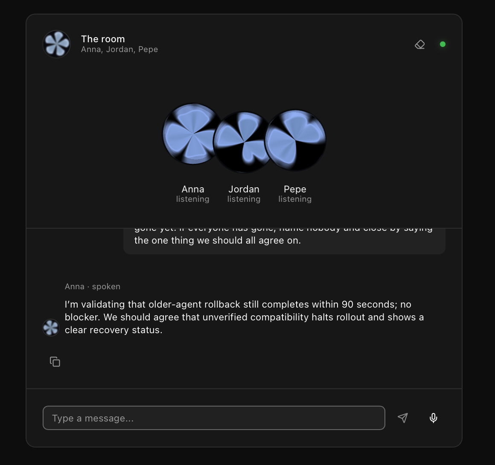
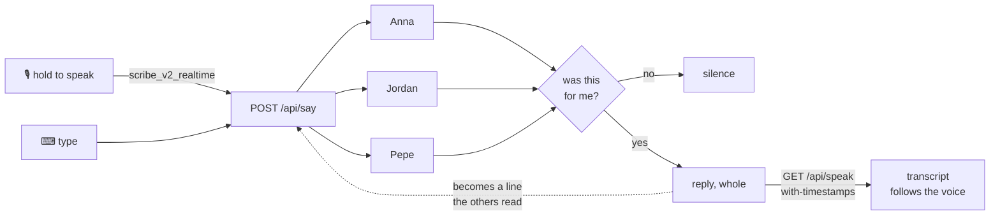

# Teaching agents to shut up

<p align="center">
  
</p>

Three agents in a browser room. They read the same transcript, each decides for
itself whether a line was meant for it, and the one that answers answers out
loud. Type into it, or hold the microphone and speak.

Built as customer zero. Every number below came off this project's own
free-plan key.

```
> hey everyone, how's it going?
  Anna stayed quiet
  Jordan stayed quiet
  Pepe stayed quiet

> hey ana ask pepe what time it is
  Anna: Pepe, what time is it?
  Jordan stayed quiet
  Pepe stayed quiet
  Pepe: It's 3:47pm.
```

## The shape



The dotted edge is the part that makes it a room: an agent's reply re-enters as
a line attributed by name, exactly like a person's, and the round ends when
nobody thought the last thing said was for them.

## Stack

| | |
|---|---|
| Chat | `openai/gpt-5.6-sol` via OpenRouter |
| TTS | `eleven_flash_v2_5`, `/with-timestamps` |
| STT | `scribe_v2_realtime`, realtime WebSocket |
| UI | ElevenLabs UI on shadcn, Next.js 16, React 19 |
| Agents | [Hermes](https://github.com/NousResearch/hermes-agent), one process each |

Model ids live in `src/defaults.py` and nowhere else. A test parses that file
and fails if the TypeScript copy drifts.

---

## A bug in the UI registry: [elevenlabs/ui#82](https://github.com/elevenlabs/ui/issues/82)

```ts
// blocks/realtime-transcriber-01/page.tsx:334
modelId: "scribe_realtime_v2" as const   // the API wants scribe_v2_realtime
```

The socket **opens**, then the server closes it. So it reads as a broken
microphone, not a bad parameter:

```
{"message_type":"invalid_request",
 "error":"The model_id 'scribe_realtime_v2' is invalid. Supported models:
          'scribe_v2_realtime', 'scribe_v2_realtime_turbo', 'scribe_v2_realtime_lite'."}
closed 1008 invalid_request
```

Same value in `public/r/realtime-transcriber-01.json`, so `shadcn add` ships it
broken. `elevenlabs/examples` already has it right. Filed with a standalone
repro, 2026-08-29.

## Text to speech

Same voice, same sentence:

| | |
|---|---|
| `eleven_flash_v2_5` | **0.7s** |
| `eleven_multilingual_v2` | 1.2s |
| `eleven_v3` | 2.7s |

Two decisions worth more than the model choice.

**Synthesis left the turn.** It used to run inside the agent, so the reply did
not leave until the MP3 existed: `1.96s of a 4.14s turn`, spent on an empty
room. The browser asks for audio now, and the text lands two seconds sooner.

**The route answers JSON, not audio**, because it asks for the timings:

```ts
POST /v1/text-to-speech/${voice}/with-timestamps
→ { audio_base64, alignment: { characters, character_start_times_seconds } }
```

That is what lets the transcript follow the voice through the line instead of
sitting there finished while somebody is still saying it. Held whole, not
streamed: there is no streaming variant of the timings, and on a 211-character
reply the full clip took 2.3s against 1.9s to first byte.

Emoji come off on the way to the synthesiser only. A voice reads them as their
names, "Hey Fabri waving hand", which is tone being pronounced instead of felt.

**Voices** are picked on `high_quality_base_model_ids`, how many current model
families actually render them. Most premade voices sit at 7 or 8. Adam, who led
the account list for months, sits at **0**: a 2023 voice carried for
compatibility, which is exactly why he sounded flat. Nothing under 7 is in the
list. The shared library needs Creator tier and fails quietly on free
(`paid_plan_required`, `free_users_not_allowed`), so ten premade voices is what
a free key can demo.

## Speech to text

The key never reaches the browser:

```ts
POST /v1/single-use-token/realtime_scribe   →  one session, nothing else
```

**Press to speak, not open mic.** An open microphone was built first and cut: in
a room where three agents talk out loud, no VAD threshold separates a person
from a speaker reliably enough to send what it heard to three agents unasked.
What survived is one testable function, `lib/listening.ts`, deciding whether
anything was said between the two presses. Fillers and `[BLANK_AUDIO]` come off;
one real word still counts, because "sí" and "stop" are whole turns.

**The transcriber renamed an agent.** She was Ana. "Ana" and "Anna" are one
sound in two languages and a transcriber listening in English writes the English
one, so she sat silent while being called by name, out loud, twice. Fixed both
ways: the addressing check collapses held letters, and she is spelled Anna now.
Invisible in any text-only test.

Measured 2026-08-29: first partial in 3-4s, full sentence recovered, on
Rioplatense Spanish.

## ElevenLabs UI

`Orb`, `LiveWaveform`, `Conversation`, `Message`, `Response` and the Scribe hook
came from the registry. Three things had to change, all the same kind of problem:
correct in a demo, load-bearing here.

| | |
|---|---|
| `useTexture` suspends on a CDN fetch | Three empty holes where the agents go, for as long as `storage.googleapis.com` takes. 45KB, served from `/public` now. |
| `THREE.WebGLRenderer: Context Lost.` ×3 | A capped resource the browser reclaims when it likes. An SVG orb sits underneath, paints on frame one, cannot be lost. |
| Two scroll springs, one element | `use-stick-to-bottom` and the room both eased toward `scrollHeight`, a target that moves mid-flight. Both instant now, so they cannot disagree. |

## Evaluated, not taken

| | |
|---|---|
| [#8](https://github.com/humanagent/hermes-elevenlabs/issues/8) `text-to-dialogue` | Works on free (113,728 bytes, 7.0s, two voices). Lost on latency: first sound **+0.0s → ~+15.2s**, because a dialogue needs every reply before it can start. |
| [#9](https://github.com/humanagent/hermes-elevenlabs/issues/9) TTS `/stream` | Verified 200. Superseded by `with-timestamps`, same two seconds plus the timings. |
| [#13](https://github.com/humanagent/hermes-elevenlabs/issues/13) streaming the model | **469 turns ended in a suppress token.** Streaming means showing text from an agent that then says nothing. |
| [#10](https://github.com/humanagent/hermes-elevenlabs/issues/10) `elevenlabs/examples` | A pass over all of it, with what this room would have to become for each to fit. |

## The agents

Upstream Hermes through its public plugin interfaces. No fork: three hooks and
one middleware. Each agent is its own process with its own memory and its own
persona, every line reaches everyone, and nobody is told whose turn it is.

The turn-taking policy came over from a text product I had already run in
production, so porting it was mostly deleting the transport. Two rules carry it:
a turn that ends in nothing counts as success, and addressing is a function
rather than a prompt. `SETUP.md` has the long version.

```
20:07:13 [llm]     round=1 gpt-5.6-sol in=310 (cache_r=26,112 hit=99%) out=81 stop 3.2s
20:07:16 [policy]  quiet   reason='suppress token' raw=8 → 0
```

## Running it

```sh
pnpm setup                             # writes .hermes/ with a config and a key
# add a provider key + ELEVENLABS_API_KEY to .hermes/.env
pnpm start                             # the runtime
uv run python scripts/group_up.py      # Anna, Jordan, Pepe
pnpm web                               # the room
```

`pnpm status` says what is missing. `pnpm tui` is the same in a terminal, plus
the log. 250 Python tests and 34 in the browser; lint, types, both suites and a
production build run on every PR. `QA.md` is the manual pass.

## Next

An MCP server over the agents, knowledge base and voice APIs, so an agent's
lifecycle runs from whatever tool is already open. The shape is here already:
this repo runs three agent processes, deals them personas and reconciles their
config on every boot. A typed control surface on that, speaking MCP, is the same
work with a different caller.
